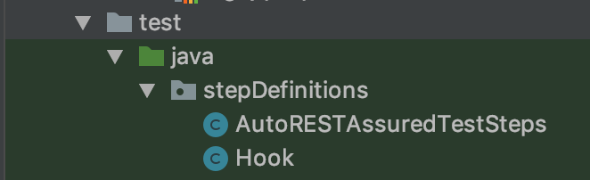
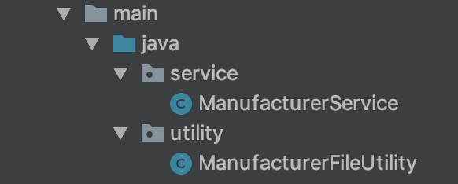
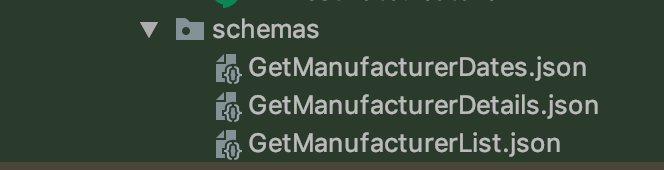
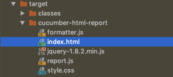
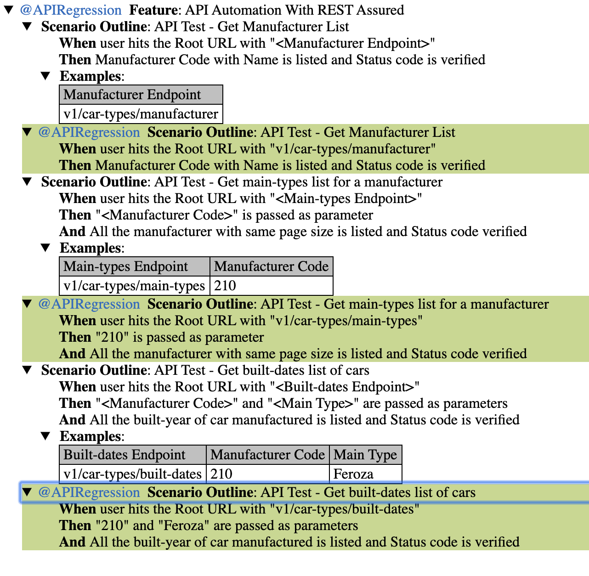

# API_BDD_Framework

Behavioural driven development automation framework using REST Assured, cucumber-java, testng and maven

##Tools and technologies used:

1. Language: Java 8
2. Testing framework: TestNG, Junit
3. BDD framework: Cucumber
4. Automation tool: REST Assured
5. Build tool: Maven
6. Logging: log4j

##Features of the framework
1. BDD framework using Cucumber. Feature files can be written easily using Given,When, Then etc.
2. API Tests can run using Rest Assured and java.
3. Html report gets generated after each test run and can be found /target/cucumber-html-report/index.html

**package: featureFiles** : It contains all different features (tests) files. 

**package: testRunners** : It includes the main driving class which runs all the tests present in test suit depending on the parameters passed in @tag section.It includes the common classes (and methods) which are required by each test to perform actions. Below are classes in this package:

**package: stepDefinitions** : It includes the corresponding feature files definitions in java.It includes the common classes (and methods) which are required by each test to perform actions. Below are classes in this package:

**package: Service and Utility** : It includes the common classes (and methods) which are required by each test to perform actions. Below are classes in this package:

**Hook.java** : It contains Before and After assertion for each test which gets executed automatically.
**ecabsTest.log** : It contains all the logs which can be used to track the past execution and present as well.

**schemas: Output Validation by JSONSchemaValidator:**
* This files contains the output format of each endpoint and validates against the output we get after hitting the respective URL with endpoint.
 
 
 
**index.html:** It will have test execution report:

Test execution (Index.html) report will look as below:

##Setting up the project

Install the maven and clone the build then got to terminal or command prompt:

**$ cd Navigate to the project**

**$ mvn clean install**

##Execution of tests  
There are following ways we can execute the test:

**First of all we have to modify the file commons.properties with actual URL and wa_key. Then Update the APITestAuto.feature file with actual endpoints.**

**1. Individually by tagging**

* We can provide tag name in the feature file on top (ex. @anyName ) and same we can pass in testRunner.java class in @tag parameter. Example is shown in testRunner.java 

* Navigate to Project folder and hit the command **$ mvn test**

**2. All the tests at a time**

* Navigate to Project folder and hit the command **$ mvn test**

**3. We can also run the test from TestNG.xml file and APITestAuto.feature file**

* Just Right Click and run the feature or TestRunner file*
